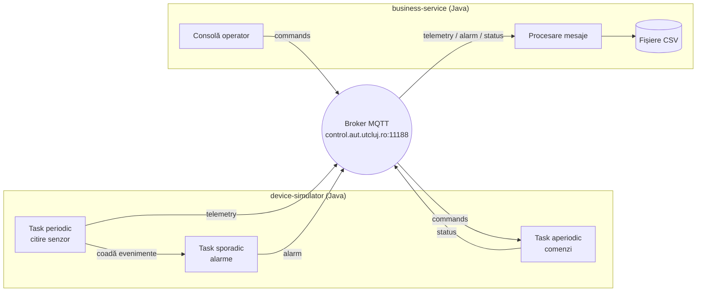

# Tema 01 – Aplicație IoT cu taskuri periodice, sporadice și aperiodice

**Tehnologii:** Java 17+, Maven, MQTT (Eclipse Paho), diagrame UML
**Termen de predare:** _de stabilit_

## Obiective

După rezolvarea temei, veți putea să:

- identificați și implementați cele trei tipuri de taskuri din sistemele de timp real: **periodic**, **sporadic** și **aperiodic**;
- folosiți un broker de mesaje **MQTT** pentru comunicarea dintre dispozitive și servicii;
- construiți o aplicație IoT completă: dispozitiv → broker → serviciu → dispozitiv.

## Arhitectura sistemului



Sistemul are trei componente:

1. **device-simulator**: o aplicație Java care simulează un dispozitiv cu senzor de temperatură. Pot rula mai multe instanțe simultan, cu ID-uri diferite.
2. **brokerul MQTT**: pus la dispoziție de facultate, nu trebuie instalat.
3. **business-service**: o aplicație Java care preia datele de la toate dispozitivele, le stochează, le afișează și trimite comenzi înapoi.

## Noțiuni teoretice

Terminologia este cea din curs: [2.3 Eliberare periodică](https://control.aut.utcluj.ro:8030/part-02-time/03-periodic-release/) și [3.2 Modelul de task](https://control.aut.utcluj.ro:8030/part-03-scheduling/02-task-model/). Pe scurt:

- un **task** este regula după care apar execuțiile; fiecare execuție este un **job**;
- **eliberarea** $r$ este momentul în care jobul devine gata de execuție;
- un job are un **timp de calcul** $C$ și trebuie să termine până la **termenul-limită** $D$, măsurat de la eliberare;
- **timpul de răspuns** $R$ este durata de la eliberare până la terminare; termenul este respectat dacă $R \le D$.

| Tipul | Ce se știe despre eliberări | $T$ în model | Ce se poate garanta | Exemplu în temă |
|-------|-----------------------------|--------------|---------------------|-----------------|
| **periodic** | toate momentele, dinainte: $r_k = r_0 + kT$ | perioada exactă | termene hard | citirea senzorului și publicarea temperaturii |
| **sporadic** | intervalul minim dintre două eliberări: _intervalul minim între sosiri_ (minimum inter-arrival time) | intervalul minim | termene hard, cu rezervă pentru cel mai rău caz | alarma la depășirea pragului de temperatură |
| **aperiodic** | nimic despre frecvență | nu există | de obicei doar termene soft sau „cât mai repede” | executarea unei comenzi primite de la server |

Java standard nu oferă mecanisme de timp real pentru aceste tipuri de taskuri: nu garantează momentul eliberării și nu impune intervalul minim între sosiri sau termenul-limită. Le vom **simula** cu mecanismele obișnuite de concurență:

- task periodic: `ScheduledExecutorService` sau o buclă cu **așteptare absolută** până la următoarea eliberare de pe grilă;
- task sporadic: un thread care preia evenimente dintr-o `BlockingQueue` și impune singur intervalul minim între sosiri;
- task aperiodic: un thread care preia evenimente dintr-o `BlockingQueue` în ordinea sosirii.

Pentru **MQTT**, rețineți:

- **publish/subscribe**: clienții nu comunică direct, ci prin broker, pe **topic-uri**;
- **wildcard-uri**: `+` înlocuiește un singur nivel (`ssatr/ion/devices/+/telemetry`), `#` înlocuiește oricâte niveluri;
- **QoS**: 0 = cel mult o dată, 1 = cel puțin o dată, 2 = exact o dată.

## Resurse puse la dispoziție

### `exemple/01-taskuri/`

Câte un program scurt, independent, pentru fiecare tip de task:

| Clasă | Ce ilustrează |
|-------|---------------|
| `PeriodicTaskExample` | eliberări pe grila $r_k = r_0 + kT$ (așteptare absolută); întârzierea fiecărui job față de grilă și jitterul |
| `SporadicTaskExample` | impunerea intervalului minim între sosiri (evenimentele prea dese sunt respinse); verificarea $R \le D$ |
| `AperiodicTaskExample` | coadă de comenzi; timpul de răspuns crește când comenzile sosesc în rafală |

```bash
cd exemple/01-taskuri
mvn -q compile exec:java -Dexec.mainClass=ssatr.exemple.taskuri.PeriodicTaskExample
mvn -q compile exec:java -Dexec.mainClass=ssatr.exemple.taskuri.SporadicTaskExample
mvn -q compile exec:java -Dexec.mainClass=ssatr.exemple.taskuri.AperiodicTaskExample
```

### `exemple/02-mqtt/`

Un publisher și un subscriber minimali. Înainte de rulare, **schimbați `STUDENT` în `MqttConfig.java`** cu numele vostru.

```bash
cd exemple/02-mqtt
# terminalul 1
mvn -q compile exec:java -Dexec.mainClass=ssatr.exemple.mqtt.MqttSubscriberExample
# terminalul 2
mvn -q compile exec:java -Dexec.mainClass=ssatr.exemple.mqtt.MqttPublisherExample
```

Traficul se poate urmări și cu clientul `mosquitto_sub`, dacă este instalat:

```bash
mosquitto_sub -h control.aut.utcluj.ro -p 11188 -t 'ssatr/popescu-ion/#' -v
```

### `exemple/03-diagrame/`

Exemple simple de diagrame, desenate în [draw.io](https://app.diagrams.net). Sursa editabilă este `exemple-diagrame.drawio`, cu câte un tab pentru fiecare diagramă. Alături se află imaginile exportate:

| Tab | Imagine | Ce arată |
|-----|---------|----------|
| Diagramă de timp | [`diagrama-de-timp.png`](exemple/03-diagrame/diagrama-de-timp.png) | notația din curs: eliberări, joburi, timpul petrecut în Ready, preempțiuni, termene-limită absolute, un eveniment sporadic respins, un task aperiodic |
| Diagramă de componente | [`diagrama-de-componente.png`](exemple/03-diagrame/diagrama-de-componente.png) | componente UML și interfețele oferite / folosite între ele |
| Diagramă de secvență | [`diagrama-de-secventa.png`](exemple/03-diagrame/diagrama-de-secventa.png) | participanți, mesaje sincrone, răspunsuri și un mesaj asincron |

Diagramele de componente și de secvență sunt generice: ilustrează doar notația, nu soluția temei.

Fișierul `.drawio` se deschide cu aplicația draw.io (desktop), în browser pe [app.diagrams.net](https://app.diagrams.net) sau cu extensia Draw.io Integration din VS Code / IntelliJ.

### `start/`

Două proiecte Maven care compilează. Sunt deja implementate conexiunea MQTT (`MqttConnection`), senzorul simulat (`TemperatureSensor`) și stocarea în fișiere CSV (`CsvStorage`). Locurile unde trebuie să lucrați sunt marcate cu `TODO 1` … `TODO 6`.

```bash
cd start/device-simulator
mvn -q compile exec:java -Dexec.args="device-1"     # alt terminal: -Dexec.args="device-2"

cd start/business-service
mvn -q compile exec:java
```

## Brokerul MQTT

| | |
|---|---|
| Adresă | `tcp://control.aut.utcluj.ro:11188` |
| Autentificare | nu este necesară |

Brokerul este **partajat de toți studenții**. Toate topic-urile voastre încep cu `ssatr/<student>/`, unde `<student>` este numele vostru, fără spații sau diacritice (de exemplu `popescu-ion`). Îl setați o singură dată, în `Config.java`, identic în ambele aplicații.

### Topic-uri și formatul mesajelor

Mesajele sunt text simplu, cu câmpurile separate prin `;`. Timpul este `System.currentTimeMillis()`, iar numerele zecimale se scriu cu punct (`23.45`).

Business service-ul salvează fiecare mesaj primit în `data/<tip>.csv` (`telemetry`, `alarm`, `status`), exact cum a sosit.

| Topic | Direcție | Tip task | Conținut |
|-------|----------|----------|----------|
| `ssatr/<student>/devices/<id>/telemetry` | device → service | periodic | `deviceId;timestamp;temperatura` |
| `ssatr/<student>/devices/<id>/alarm` | device → service | sporadic | `deviceId;timestamp;temperatura;prag` |
| `ssatr/<student>/devices/<id>/commands` | service → device | aperiodic | `SET_INTERVAL 1000` |
| `ssatr/<student>/devices/<id>/status` | device → service | aperiodic | `deviceId;timestamp;OK SET_INTERVAL 1000` |

Comenzile pe care trebuie să le accepte device-ul:

| Comandă | Efect |
|---------|-------|
| `SET_INTERVAL <ms>` | schimbă perioada $T$ a taskului periodic |
| `SET_THRESHOLD <valoare>` | schimbă pragul de alarmă |
| `RESET` | readuce senzorul la valoarea inițială |
| `STATUS` | răspunde cu perioada și pragul curente |

## Cerințe

### 1. Simulatorul de device

- **TODO 1 – task periodic** (`PeriodicTelemetryTask`): la fiecare job citește senzorul și publică telemetria. Eliberările respectă grila, cu perioada $T$ = `periodMs`. Folosiți **așteptare absolută**, nu relativă, ca să nu apară derivă. Când temperatura depășește pragul, jobul pune un eveniment în coada de alarme.
- **TODO 2 – task sporadic** (`SporadicAlarmTask`): publică alarmele și impune intervalul minim între sosiri `MIN_INTERARRIVAL_MS`: evenimentele care sosesc mai des sunt respinse.
- **TODO 3 – task aperiodic** (`AperiodicCommandTask`): execută comenzile din tabelul de mai sus și publică o confirmare pe topic-ul `status`. O comandă greșită produce un mesaj `ERROR ...` și nu oprește taskul.

### 2. Serviciul business

- **TODO 4 – procesarea mesajelor** (`MessageProcessor`): salvează fiecare mesaj cu `CsvStorage` și actualizează dashboard-ul. Alarmele și confirmările se afișează imediat.
- **TODO 5 – vizualizare** (`Dashboard`): comanda `show` afișează un tabel cu starea fiecărui device (ultima temperatură, vechimea ultimului mesaj, numărul de alarme).
- **TODO 6 – comenzi** (`CommandConsole`): o linie de forma `device-1 SET_INTERVAL 1000` trimite comanda la device-ul respectiv.

### 3. Diagrame

În folderul `diagrame/` al soluției, ca sursă PlantUML, Mermaid sau draw.io, plus imagine exportată:

- **diagrama de componente** a sistemului (vezi exemplul din `exemple/03-diagrame/`);
- **diagrama de secvență** (vezi exemplul din `exemple/03-diagrame/`) pentru două scenarii:
  - telemetrie care depășește pragul și produce o alarmă;
  - operatorul trimite `SET_INTERVAL`, iar device-ul confirmă;
- **diagrama de timp** (vezi exemplul din `exemple/03-diagrame/`) pentru cele trei taskuri ale device-ului pe un interval de ~10 s: eliberările și joburile taskului periodic, o alarmă respinsă din cauza intervalului minim între sosiri și un job al taskului aperiodic.

## Predare

Soluția se află în fork-ul vostru, în folderul `tema-01-iot-mqtt/`:

```
tema-01-iot-mqtt/
├── start/
│   ├── device-simulator/     # proiectul completat
│   └── business-service/     # proiectul completat
└── diagrame/                 # diagramele cerute
```

După push, adăugați commit ID-ul soluției (`git rev-parse HEAD`) ca **comentariu** la assignment-ul temei din **Microsoft Teams** și apăsați **Turn in**. Detalii în [README-ul principal](../README.md#predare).

## Bibliografie

- Cursul: [2.3 Eliberare periodică](https://control.aut.utcluj.ro:8030/part-02-time/03-periodic-release/), [3.2 Modelul de task](https://control.aut.utcluj.ro:8030/part-03-scheduling/02-task-model/)
- G. C. Buttazzo, _Hard Real-Time Computing Systems_, Springer: cap. 2 și 4
- [Documentația Eclipse Paho Java](https://eclipse.dev/paho/files/javadoc/index.html)
- [MQTT Essentials (HiveMQ)](https://www.hivemq.com/mqtt/)
- [`java.util.concurrent`](https://docs.oracle.com/en/java/javase/21/docs/api/java.base/java/util/concurrent/package-summary.html)
